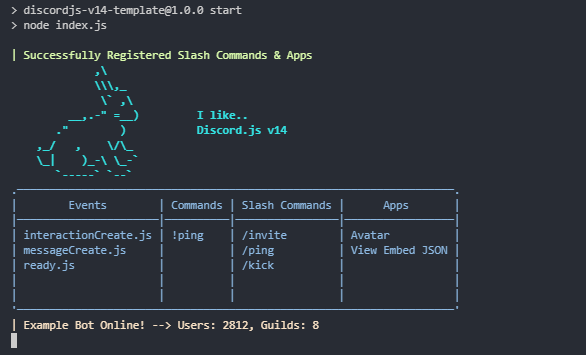

<center>
 
 <h3>Discord.JS v14 Template</h3>
</center>

**A simple Discord.js message command/slash command and apps handler template. I created this project to simplify the process of creating new bots and avoid writing the same code again.**

Some of the main focuses of this template are **command/event handlers** and **app handlers**. Command handlers also include **permissions, aliases, and autocomplete** functionality. 

## How to Install
 - You'll need [NodeJS](https://nodejs.org/en) (16.11+). And a package manager for node. (npm, pnpm or yarn)
 - To get started with this project clone this repository to a folder and execute the following commands to that folder.
```bash
npm install 
# or
pnpm install
# or
yarn install
```
 - Once all dependencies are installed, rename `.env_copy` to `.env` and enter environment values `CLIENT_ID`, `TOKEN` and `TEST_GUILD` in this file. If you leave `TEST_GUILD` empty, the bot will register slash commands to all servers.

 - Your application needs the following intents to be allowed `PRESENCE`, `MESSAGE` and `GUILD MEMBER`. You can enable them in your [Discord Developer Dashboard](https://discord.com/developers/applications) or disable the intents you don't need from `index.js` file. Privileged intents are are marked with comments.

If you use `yarn` for installing packages, you can use `yarn install` and `yarn start`.
After finishing the cofiguration run - 
```
npm start
```

If everything is done correctly, your terminal should look like this -

#

[](https://discord.com/users/674660356819517440)
If you happen to spot any problem or errors in this project, please create a pull request or  contact me through my Discord, which is [**towsifkafi**](https://discord.com/users/674660356819517440). I'm always open to receiving direct messages and would be more than happy to help you out in any way possible.